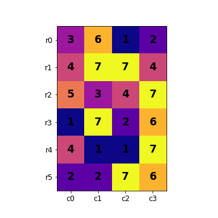

# Find potential 3-pixel objects in a 2D grid
Given a 2D grid of pixels and a value of interest, this Python code looks for every pixel of that value (called **source**) that is situated such that a swap with 1 of its 4-connected neighbours (called **destination**) would result in a 3-pixel 4-connected component of that value being created.

A **source** can have multiple **destinations** and multiple **sources** can have the same **destination**. This code computes every possible **source**-**destination** pair.

### Example:
Consider the following grid (column and row indices marked).

If the value of interest is 7, then the following are the swap options to create a 4-connected component of 3 pixels of value 7.
#### (r3, c1) <-> (r2, c1)
#### (r2, c3) <-> (r1, c3)
#### (r2, c3) <-> (r2, c2)